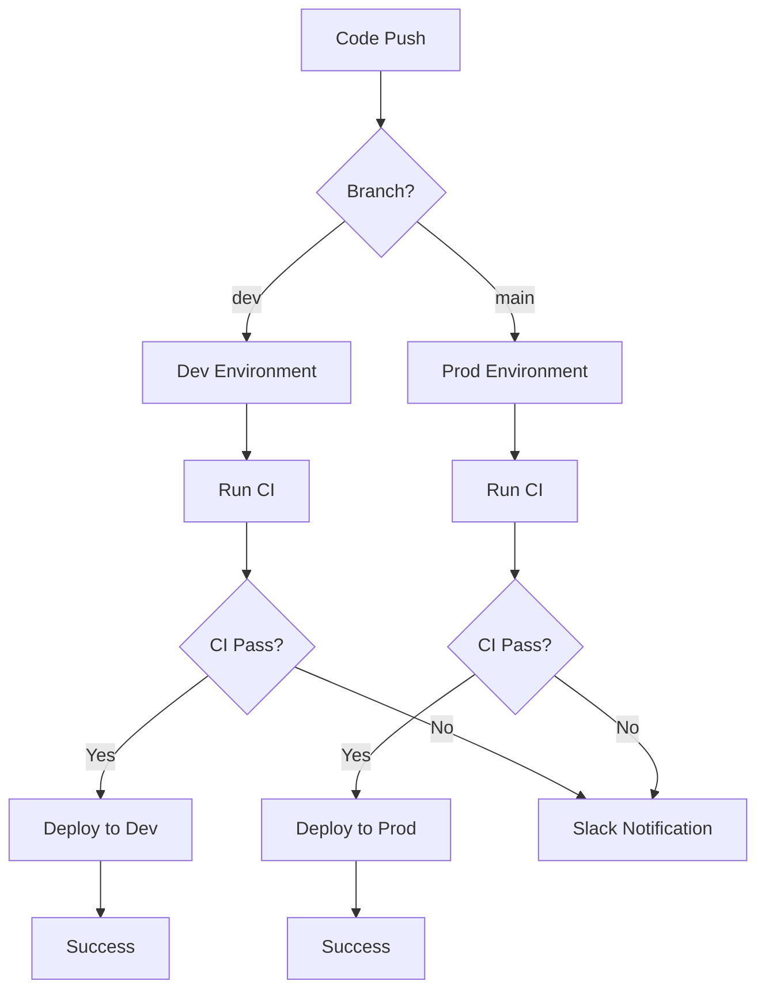

# CI/CD Pipeline

A comprehensive GitHub Actions-based CI/CD pipeline for full-stack applications with separate backend and frontend workflows.

## 📁 Repository Structure

```txt
ci-cd-pipeline/
├── backend/
│   └── .github/
│       └── workflows/
│           ├── backend-ci.yml           # Backend continuous integration
│           ├── backend-dev-deploy.yml   # Backend development deployment
│           └── backend-prod-deploy.yml  # Backend production deployment
└── frontend/
    └── .github/
        └── workflows/
            ├── frontend-ci.yml          # Frontend continuous integration
            ├── frontend-dev-deploy.yml  # Frontend development deployment
            └── frontend-prod-deploy.yml # Frontend production deployment
```

## 🔄 Workflow Overview

### Backend Workflows

#### 🧪 Backend CI (`backend-ci.yml`)

**Triggers:** Pull requests to `dev` or `main` branches

**Key Features:**

- **Python Environment Setup** (Python 3.11 + Poetry)
- **Dependency Management** with deptry validation
- **Environment Parameter Validation**
  - Direct environment variable access checks
  - `.env.example` vs `config.py` validation
  - Settings usage validation
  - SSM parameter existence verification
- **Code Quality Checks**
  - Black formatting
  - isort import sorting
  - Ruff linting
  - Hebrew character detection
- **Docker Build & Runtime Validation**
- **Slack Notifications** on failure

#### 🚀 Backend Development Deployment (`backend-dev-deploy.yml`)

**Triggers:** Push to `dev` branch

**Process:**

1. Runs backend CI pipeline
2. Deploys to EC2 instance via AWS SSM
3. Uses environment-specific secrets

#### 🏭 Backend Production Deployment (`backend-prod-deploy.yml`)

**Triggers:** Push to `main` branch

**Process:**

1. Runs backend CI pipeline
2. Deploys to production EC2 instance via AWS SSM
3. Uses production environment secrets

### Frontend Workflows

#### 🧪 Frontend CI (`frontend-ci.yml`)

**Triggers:** Pull requests to `dev` or `main` branches

**Key Features:**

- **Node.js Setup** (Node 20 + npm)
- **Code Quality Checks**
  - ESLint linting
  - Prettier formatting
  - Hebrew character detection
- **Build Validation** (environment-specific)
- **Slack Notifications** on failure

#### 🚀 Frontend Development Deployment (`frontend-dev-deploy.yml`)

**Triggers:** Push to `dev` branch

**Process:**

1. Runs frontend CI pipeline
2. Builds application with dev environment variables
3. Syncs to S3 bucket
4. Invalidates CloudFront distribution

#### 🏭 Frontend Production Deployment (`frontend-prod-deploy.yml`)

**Triggers:** Push to `main` branch

**Process:**

1. Runs frontend CI pipeline
2. Builds application with prod environment variables
3. Syncs to production S3 bucket
4. Invalidates production CloudFront distribution

## 🏗️ Architecture

### Backend Architecture

- **Language:** Python 3.11
- **Package Manager:** Poetry
- **Deployment:** EC2 instances via AWS SSM
- **Environment Management:** AWS SSM Parameter Store
- **Containerization:** Docker

### Frontend Architecture

- **Framework:** Vite-based application
- **Runtime:** Node.js 20
- **Deployment:** S3 + CloudFront
- **Build Tool:** npm

## 🔧 Configuration Requirements

### Required Secrets

#### Backend Secrets

- `RAG_SCRAPING_GITHUB_TOKEN` - GitHub token for private repo access
- `CI_AWS_ACCESS_KEY` / `CI_AWS_SECRET_ACCESS_KEY` - AWS credentials for CI
- `AWS_ACCESS_KEY_ID` / `AWS_SECRET_ACCESS_KEY` - AWS credentials for deployment
- `EC2_INSTANCE_ID` - Target EC2 instance for deployment
- `SLACK_WEBHOOK_URL` - Slack notifications
- `SSM_MISSING_SLACK_WEBHOOK_URL` - SSM parameter missing notifications

#### Frontend Secrets

- `S3_FRONTEND_BUCKET` - S3 bucket for static files
- `CF_DISTRIBUTION_ID` - CloudFront distribution ID
- `VITE_API_BASE_URL` - Backend API URL
- `VITE_LINKEDIN_*` - LinkedIn OAuth configuration

### Environment Configuration

- **AWS Region:** `eu-north-1`
- **Environments:** `dev` and `prod`
- **Branch Strategy:** `dev` → dev, `main` → production

## 🛡️ Quality Gates

### Backend Quality Checks

- ✅ Python syntax validation
- ✅ Module import verification
- ✅ Dependency audit (deptry)
- ✅ Code formatting (Black, isort)
- ✅ Linting (Ruff)
- ✅ Environment contract validation
- ✅ SSM parameter existence
- ✅ Docker build & runtime tests
- ✅ Hebrew character detection

### Frontend Quality Checks

- ✅ ESLint validation
- ✅ Prettier formatting
- ✅ Build verification
- ✅ Hebrew character detection

## 🚨 Monitoring & Notifications

- **Slack Integration:** Automatic failure notifications
- **AWS SSM Monitoring:** Parameter existence validation
- **Deployment Tracking:** Command execution monitoring

## 🔄 Deployment Flow



## 📋 Usage

1. **Development:** Push to `dev` branch triggers dev deployment
2. **Production:** Push to `main` branch triggers prod deployment
3. **Quality Assurance:** All PRs run CI checks before merge
4. **Monitoring:** Check Slack for deployment status and failures

## 🔗 Related Infrastructure

This pipeline works in conjunction with:

- **terraform-aws-infra:** Infrastructure as Code for AWS resources
- **Backend Application:** Python-based API service
- **Frontend Application:** Vite-based web application
